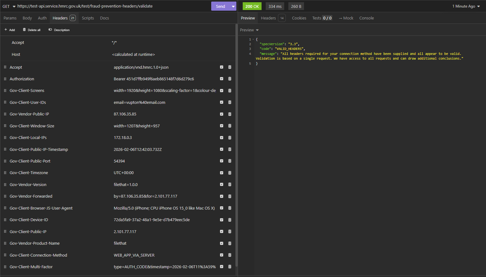
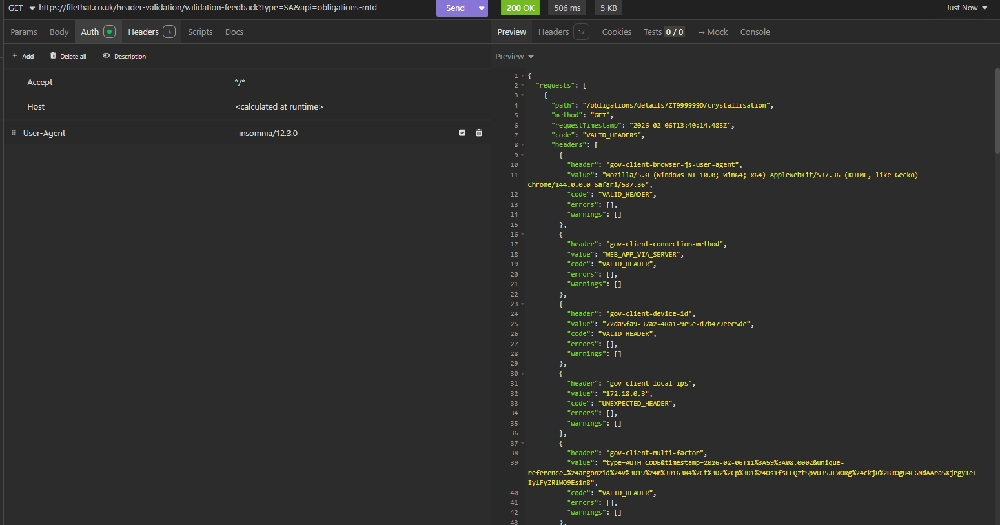

# HMRC FileThat App - Questions and Responses

## About your organisation

### Q: Provide details for a responsible individual in your organisation

**Response:**
Ritchie Francis
ritchie@filethat.co.uk
(Telephone number can be provided upon request)

---

### Q: What is your organisation's URL?

**Response:**

filethat.co.uk

---

### Q: Provide evidence that your organisation is officially registered.

**Response:**
FileThatOnline LTD - 12/02/26
Company Number 17030265

---

## Marketing

### Q: Do you use HMRC logos in your software, marketing or website?

**Response:**

No, we do not use HMRC logos in our software, marketing materials, or website.

---

### Q: Do adverts in your software comply with UK standards?

**Response:**

Our software does not contain any advertisements. We maintain an ad-free experience for all users.

---

### Q: Do you advertise your software as 'HMRC recognised'?

**Response:**

Yes, this designation is displayed on our homepage following successful completion of HMRC's recognition process.

---

### Q: Do you get your customers' consent before sharing their personal data for marketing?

**Response:**

We do not share customer personal data with third parties for marketing purposes. Customers have full control over communication preferences and can disable any non-essential notifications directly within the application settings at any time.

---

## About your processes

### Q: Do your development practices follow our guidance?

**Response:**

Yes, our development practices fully align with HMRC's guidance as outlined at https://developer.service.hmrc.gov.uk/api-documentation/docs/development-practices.

Our application architecture is designed with loose coupling and independence from the HMRC API, ensuring that changes can be implemented efficiently and without disruption to core functionality. This separation of concerns allows us to adapt quickly to API updates and maintain robust, maintainable code that adheres to industry best practices.

---

### Q: Does your error handling meet our specification?

**Response:**

Yes, our error handling fully complies with HMRC specifications. We have implemented comprehensive safeguards including:

- **Rate Limiting**: Intelligent request throttling to prevent excessive API calls
- **Retry Strategy**: Automated retry logic with exponential backoff for transient failures
- **User Communication**: All errors are presented to users in clear, concise, and actionable language, ensuring they understand any issues and how to resolve them

This approach ensures system stability while maintaining a positive user experience.

---

### Q: Does your software meet accessibility standards?

**Response:**

Our software substantially meets accessibility standards. We have built our application using Material-UI (MUI), a framework that incorporates WCAG 2.1 accessibility guidelines and provides built-in support for screen readers, keyboard navigation, and ARIA attributes.

While we have achieved strong compliance across most accessibility criteria, we acknowledge that we are not yet at 100% conformance. We are committed to continuous improvement and regularly enhance our accessibility features to ensure all users can interact with our software effectively, regardless of their abilities. Accessibility remains a key priority in our ongoing development roadmap.

---

## Service management practices

### Q: Do you provide a way for your customers or third parties to tell you about a security risk or incident?

**Response:**

Yes, we provide multiple channels for reporting security concerns:

- **Contact Form**: A dedicated security contact form accessible from our website, ensuring all security-related communications are prioritized and routed to our technical team
- **Direct Email**: Security incidents can be reported directly to our admin email address (admin@filethat.co.uk)
- **Response Time**: All security-related reports are acknowledged within 24 hours and investigated immediately

We encourage responsible disclosure and take all security reports seriously, regardless of the source.

---

### Q: Do you have a process for notifying HMRC in the case of a security breach?

**Response:**

Yes, we have established a comprehensive security breach notification protocol:

- **Immediate Assessment**: Upon discovery of any security incident, our team conducts an immediate impact assessment to determine if HMRC data or systems are affected
- **72-Hour Notification**: If the breach involves HMRC services, customer tax data, or API credentials, we notify HMRC's Security Operations Centre within 72 hours via their designated security incident reporting channel
- **Documentation**: All incidents are logged with detailed information including the nature of the breach, affected data, timeline, and remediation steps taken
- **Follow-up Communication**: We provide ongoing updates to HMRC throughout the investigation and resolution process
- **Post-Incident Review**: After resolution, we conduct a thorough review to prevent recurrence and share findings with HMRC as required

This process aligns with UK GDPR requirements and HMRC's security incident management guidelines.

---

## About your software

### Q: Do you comply with the UK General Data Protection Regulation (UK GDPR)?

**Response:**

Yes, we fully comply with the UK General Data Protection Regulation (UK GDPR). Our compliance framework includes:

- **Lawful Basis for Processing**: We process customer data only with explicit consent and for legitimate purposes related to HMRC tax submission services
- **Data Minimization**: We collect and retain only the minimum data necessary to provide our services
- **Right to Access**: Customers can request access to their personal data at any time
- **Right to Erasure**: Customers can request deletion of their data, subject to legal retention requirements
- **Data Breach Procedures**: We have established protocols for detecting, reporting, and responding to data breaches within the required 72-hour timeframe
- **Privacy by Design**: Data protection principles are embedded into our software architecture from the ground up
- **Regular Reviews**: We conduct periodic audits of our data processing activities to ensure ongoing compliance

---

### Q: Do you encrypt all customer data that you handle?

**Response:**

Yes, we employ comprehensive encryption protocols to protect all customer data:

- **Data in Transit**: All data transmitted between users and our servers is encrypted using TLS 1.3 with strong cipher suites
- **Data at Rest**: Customer data stored in our databases is encrypted using industry-standard encryption algorithms (AES-256)
- **API Communications**: All interactions with HMRC APIs are conducted over encrypted HTTPS connections
- **Token Storage**: OAuth tokens and sensitive credentials are encrypted before storage

This multi-layered encryption approach ensures customer data remains secure throughout its entire lifecycle.

---

### Q: Do you ensure that each customer's data cannot be accessed by unauthorised users?

**Response:**

Yes, we have implemented a robust multi-layered security model to prevent unauthorized access:

- **JWT (JSON Web Tokens)**: We use signed JWT tokens for user authentication and authorization. Each token contains encrypted claims that verify user identity and permissions, with automatic expiration to limit exposure
- **OTP (One-Time Password)**: We implement OTP-based two-factor authentication for enhanced account security, ensuring that even if credentials are compromised, unauthorized access is prevented
- **Session Management**: User sessions are strictly managed with automatic timeout and secure token refresh mechanisms
- **Data Isolation**: Each customer's data is logically isolated, with database-level access controls ensuring that queries can only retrieve data belonging to the authenticated user
- **Authentication Required**: All API endpoints requiring customer data access enforce authentication and authorization checks before processing requests

This defense-in-depth approach ensures that customer data remains accessible only to the rightful account owner.

---

### Q: Do you have access control for employees using customer data?

**Response:**

Yes, we have implemented Role-Based Access Control (RBAC) for all personnel with system access:

- **RBAC Implementation**: Access to customer data is governed by role-based permissions, ensuring that team members can only access data necessary for their specific responsibilities
- **Principle of Least Privilege**: Each role is assigned the minimum level of access required to perform legitimate business functions
- **Database Access Controls**: Direct database access is restricted and logged, with additional authentication requirements for any administrative operations
- **Audit Logging**: All access to customer data is logged with timestamps and user identification for accountability and compliance purposes
- **Regular Reviews**: Access permissions are reviewed regularly to ensure they remain appropriate and necessary

These controls ensure that customer data is protected from internal misuse while allowing necessary operational access.

---

### Q: Can customers get their data from your software if they switch providers?

**Response:**

Yes, we support customer data portability in accordance with UK GDPR requirements:

- **Submission Receipts**: Customers can download comprehensive submission receipts and confirmation documents for all tax filings made through our platform
- **Data Export**: We provide mechanisms for customers to export their stored data in commonly accessible formats
- **Minimal Data Retention**: As part of our data minimization approach, we only store essential information necessary for our service (primarily submission history and HMRC-related identifiers such as NINO and VRN)
- **No Vendor Lock-in**: Our architecture ensures customers are not dependent on our platform to access their historical tax submission records

We are committed to ensuring customers maintain control over their data and can transition to alternative providers without loss of important information.

---

### Q: Do you store your customers' HMRC sign in details?

**Response:**

No, we do not store customers' HMRC sign-in credentials (usernames or passwords).

Our application uses HMRC's OAuth 2.0 authorization flow, which is the secure, industry-standard method for accessing HMRC services:

- **OAuth Tokens Only**: We store only the OAuth access and refresh tokens generated through HMRC's authorization process. These tokens are encrypted at rest and provide time-limited access to HMRC APIs on behalf of the user
- **No Password Storage**: Customer HMRC Government Gateway credentials never pass through or are stored on our systems
- **Limited Identifiers**: The only customer identifiers we store are essential HMRC reference numbers (NINO for individuals and VRN for VAT-registered businesses) which are necessary for tax submission processing
- **Token Security**: All stored tokens are encrypted and automatically expire according to HMRC's security policies, requiring re-authorization when necessary

This approach aligns with HMRC's security requirements and OAuth 2.0 best practices, ensuring customer credentials remain secure.

---

## Software security (software as a service)

### Q: Has your application passed software penetration testing?

**Response:**

Yes, we have conducted penetration testing on our application, with initial security assessments completed to identify and address vulnerabilities.

- **Current Testing**: We have performed limited penetration testing focusing on critical security areas including authentication mechanisms, data encryption, API security, and OAuth implementation
- **Findings and Remediation**: Identified vulnerabilities have been promptly addressed and retested to confirm resolution
- **Ongoing Commitment**: We are committed to expanding our security testing program. Subject to business growth and success, we plan to engage third-party security professionals to conduct comprehensive penetration testing across all application components
- **Continuous Improvement**: Security testing is an ongoing process, and we regularly review and enhance our security posture as new threats emerge

Our phased approach to penetration testing ensures that we maintain strong security practices while scaling our testing efforts appropriately with our service maturity.

---

### Q: Do you audit security controls to ensure you comply with data protection law?

**Response:**

Yes, we conduct regular audits of our security controls to ensure ongoing compliance with UK GDPR and other data protection regulations:

- **Periodic Security Reviews**: We perform scheduled reviews of access controls, encryption implementations, and data handling procedures to ensure they remain effective and compliant
- **Policy Compliance Checks**: Regular audits verify that our operational practices align with our documented privacy policies and data protection standards
- **Logging and Monitoring**: We maintain comprehensive audit logs of data access and processing activities, which are regularly reviewed for anomalies or potential compliance issues
- **Vulnerability Assessments**: Ongoing technical assessments identify potential security gaps that could impact data protection compliance
- **Documentation Updates**: Audit findings are documented, and any required remediation actions are tracked to completion
- **Regulatory Alignment**: Our audit framework is designed to ensure compliance with UK GDPR, ICO guidance, and HMRC's security requirements

These regular audits provide assurance that our security controls remain effective and that we maintain continuous compliance with data protection obligations.

---

## Fraud prevention data

### Q: Does your software submit fraud prevention data?

**Response:**

Yes, our software fully implements HMRC's fraud prevention header requirements. All API requests made to HMRC services include the complete set of prescribed fraud prevention headers as specified in HMRC's API documentation.

- **Header Implementation**: We submit all required fraud prevention headers including device identification, location data, user agent information, and timestamps
- **Specification Compliance**: Our implementation adheres to HMRC's fraud prevention header specification, ensuring accurate and complete data submission with every API call
- **Consistent Application**: Fraud prevention headers are automatically included in all HMRC API requests, ensuring no submissions are made without the required fraud prevention data

This comprehensive approach helps HMRC detect and prevent fraudulent activities while ensuring our software remains compliant with their security requirements.

---

### Q: Have you checked that your software submits fraud prevention data correctly?

**Response:**

Yes, we have thoroughly tested and verified that our software submits fraud prevention data correctly.

- **Testing Process**: We have conducted comprehensive testing of all fraud prevention header submissions using HMRC's test environment
- **Validation**: Request headers have been inspected and validated against HMRC's fraud prevention specification to ensure accuracy and completeness
- **Evidence**: Supporting evidence of correct fraud prevention header submission is provided below

**Evidence of Fraud Prevention Headers:**

Our testing confirms that all required fraud prevention data is correctly formatted and successfully transmitted with every HMRC API request.

---

## Customers authorising your software

### Q: Where are your servers that process customer information?

**Response:**

All servers that process customer information are located exclusively in the United Kingdom.

- **UK-Based Infrastructure**: We use a UK-based server provider with all computational resources and data storage located within UK jurisdictions
- **Data Sovereignty**: Customer data never leaves the UK, ensuring compliance with UK data protection laws and providing customers with the security of domestic data processing
- **Geographic Redundancy**: Our UK infrastructure includes appropriate backup and redundancy measures to ensure service continuity
- **Regulatory Compliance**: This UK-only approach ensures we meet HMRC's requirements and UK GDPR provisions regarding data processing locations

This commitment to UK-based infrastructure provides our customers with assurance that their sensitive tax information remains under UK legal jurisdiction at all times.

---

### Q: Do you have a privacy policy URL for your software?

**Response:**

Yes, our privacy policy is publicly available at:

https://filethat.co.uk/auth/privacy-policy

This policy provides comprehensive information about how we collect, use, store, and protect customer data, including details on data retention, user rights under UK GDPR, and our commitment to data security.

---

### Q: Do you have a terms and conditions URL for your software?

**Response:**

Yes, our terms and conditions are publicly available at:

https://filethat.co.uk/auth/terms

These terms outline the contractual relationship between FileThat and our users, including service scope, user responsibilities, limitations of liability, and other important legal provisions governing the use of our software.

---
